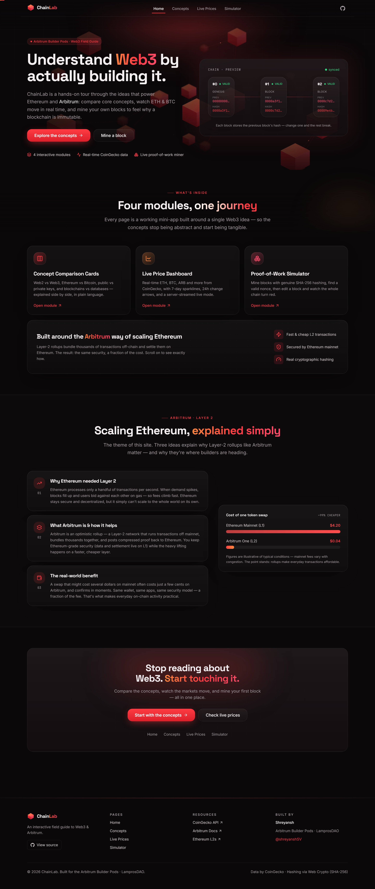
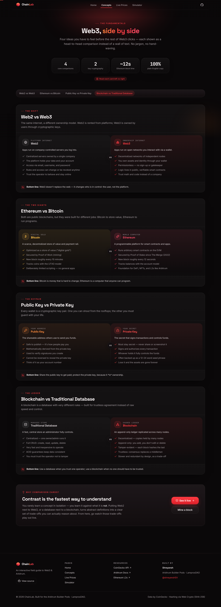
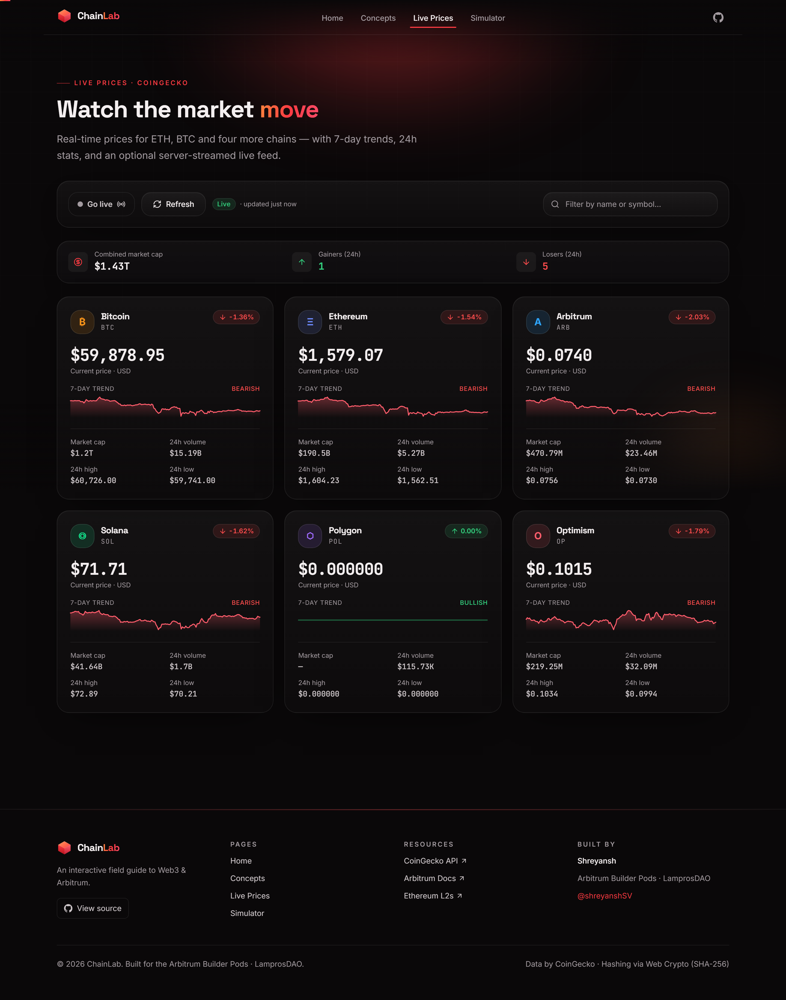
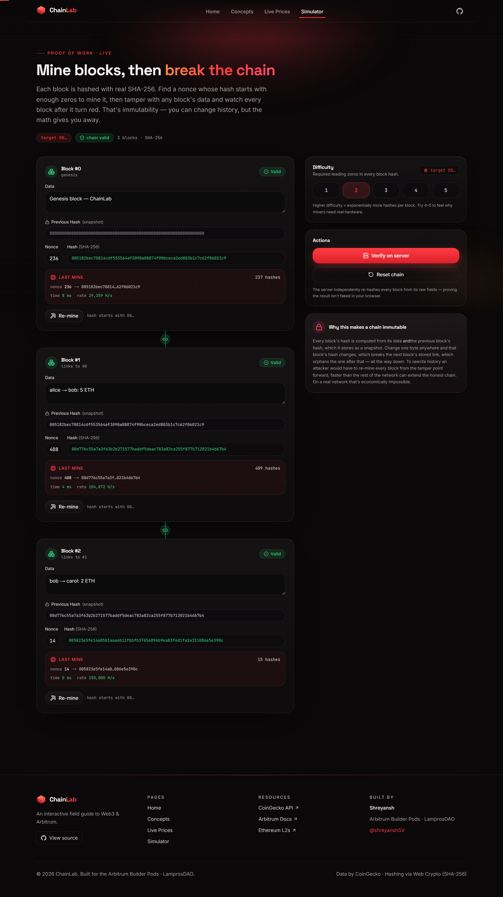

# ChainLab — An Interactive Field Guide to Web3 & Arbitrum

> Built for the **Arbitrum Builder Pods** assignment (Arbitrum Builder Labs by LamprosDAO).

ChainLab is a single, cohesive **four-page Web3 website** that turns abstract
blockchain theory into something you can touch. Pick the Arbitrum / Layer-2 theme
on the landing page, compare the core concepts side-by-side, watch real ETH & BTC
prices stream in, and mine your own blocks to *feel* why a blockchain is
immutable.

It's a **full-stack Next.js app** — not a set of static HTML files — with a real
backend layer (cached CoinGecko proxy, a Server-Sent-Events live price stream,
and server-side proof-of-work verification).

| | |
| :-- | :-- |
| **Stack** | Next.js 16 (App Router) · React 19 · TypeScript · Tailwind CSS v4 · Motion |
| **Backend** | Next.js Route Handlers (CoinGecko proxy + cache, SSE stream, chain verifier) |
| **Theme** | Arbitrum / Layer-2 overview · dark-mode-first design system |
| **Data** | CoinGecko public API (no key) · Web Crypto SHA-256 |

---

## ✨ The Four Pages

| # | Page | Route | What it does |
| :-: | :-- | :-- | :-- |
| 1 | **Home / Landing** | `/` | Hero + features + an **Arbitrum / Layer-2 explainer** (why Ethereum needed L2, what Arbitrum is, the real-world benefit) with an animated gas-fee comparison and a "how blocks connect" visual. |
| 2 | **Concepts** | `/concepts` | Visual side-by-side comparison cards for **Web2 vs Web3**, **Ethereum vs Bitcoin**, **Public vs Private Key**, and **Blockchain vs Traditional Databases** — explained in plain language, no paragraphs of textbook dump. |
| 3 | **Live Prices** | `/prices` | Real-time **ETH, BTC, ARB, SOL, POL, OP** price dashboard from CoinGecko: USD price, 24h change with green/red arrows, 7-day sparklines, market cap/volume, a **Refresh** button, a **LIVE** Server-Sent-Events mode, search/filter, and a market summary. |
| 4 | **Block Simulator** | `/simulator` | An interactive **proof-of-work miner**: edit block data, hit **Mine** to find a nonce whose SHA-256 hash starts with `00…`, and watch the **chain break** when you tamper with an earlier block. Includes server-side chain verification. |

All four pages share one navbar (with the active page highlighted), one footer,
one background, and one design system — it feels like a single product.

---

## 🚀 Features at a glance

- **Cohesive design system** — dark, Arbitrum-blue themed, with Space Grotesk /
  Inter / JetBrains Mono typography, glassmorphism surfaces, and tasteful motion.
- **Real backend, not just fetch-in-the-browser:**
  - `GET /api/prices` — CoinGecko proxy with a 15s in-memory **TTL cache**,
    8s timeout, and graceful degradation (serves stale cache, then a seed
    fallback, so the dashboard never renders empty).
  - `GET /api/prices/stream` — **Server-Sent Events**; pushes fresh prices every
    ~12s over one long-lived connection (powers the LIVE toggle).
  - `POST /api/verify-chain` — **independently re-hashes** a submitted chain on
    the server and checks proof-of-work + linkage (trustless verification).
- **Genuine cryptography** — hashing uses the Web Crypto API (SHA-256), the same
  code path on client and server.
- **Accessible & responsive** — keyboard focus states, `aria-label`s, color is
  never the only signal, `prefers-reduced-motion` respected, fluid from 360px to
  1440px.

---

## 🛠️ Run it locally

**Prerequisites:** Node.js **20.9+** and npm.

```bash
# 1. clone the repo
git clone https://github.com/shreyanshSV/Arbitrum-Builder-Pods-Blockchain.git
cd Arbitrum-Builder-Pods-Blockchain

# 2. install dependencies
npm install

# 3. start the dev server
npm run dev
```

Open **http://localhost:3000**.

No environment variables or API keys are required — the CoinGecko endpoints used
are free and public.

### Production build

```bash
npm run build
npm run start
```

---

## 📁 Project structure

```
arbitrum-builder-lab/
├── app/
│   ├── layout.tsx              # root layout: fonts, metadata, navbar, footer, background
│   ├── page.tsx                # Page 1 — Home / Landing
│   ├── concepts/page.tsx       # Page 2 — Concepts
│   ├── prices/page.tsx         # Page 3 — Live Prices
│   ├── simulator/page.tsx      # Page 4 — Block Simulator
│   ├── globals.css             # design tokens + utility classes (Tailwind v4)
│   └── api/
│       ├── prices/route.ts          # cached CoinGecko proxy
│       ├── prices/stream/route.ts   # SSE live price stream
│       └── verify-chain/route.ts    # server-side proof-of-work verifier
├── components/
│   ├── layout/                 # Navbar, Footer, BackgroundFX, Logo
│   ├── ui/                     # Button, Card, Badge, SectionHeading, Reveal, CountUp, Sparkline
│   ├── home/  concepts/  prices/  simulator/   # per-page components
├── lib/
│   ├── site.ts                 # brand + navigation (single source of truth)
│   ├── utils.ts                # cn() + formatters
│   ├── crypto.ts               # SHA-256 hashing + proof-of-work miner
│   └── coingecko.ts            # server-side data layer + cache
└── README.md
```

---

## 📸 Screenshots

| Home | Concepts |
| :--: | :--: |
|  |  |

| Live Prices | Block Simulator |
| :--: | :--: |
|  |  |

---

## 🧠 How the Block Simulator proves immutability

1. Each block's hash is `SHA-256(index | timestamp | data | previousHash | nonce)`.
2. **Mining** increments the nonce until the hash starts with N zeros (the
   difficulty) — simulated proof-of-work.
3. Each block stores the **previous block's hash**. Block 0 links to the genesis
   hash (64 zeros).
4. **Edit an earlier block** and its hash changes → it no longer satisfies the
   difficulty *and* the next block's `previousHash` no longer matches → every
   later block turns invalid. That cascade is immutability made visible. Re-mine
   from the broken block to repair the chain.
5. Hit **Verify on server** and `/api/verify-chain` re-computes everything
   independently — the chain is only valid if the data itself produces the
   claimed, properly-linked hashes.

---

## ⚠️ Known issues & things I'd improve

- **CoinGecko rate limits** — the free public API can return `429` under heavy
  use. The proxy mitigates this with a TTL cache and falls back to the last good
  data (or a seed), but live values may briefly lag during a rate-limit window.
- **Sparklines are 7-day** from CoinGecko; a future version could add selectable
  ranges (24h / 7d / 30d) and a full interactive chart.
- **Block Simulator persistence** — the mined chain lives in memory and resets on
  reload. A natural next step is persisting it (e.g. SQLite or localStorage) and
  letting users add/remove blocks dynamically.
- **No wallet integration yet** — connecting a wallet to read a real Arbitrum
  balance would be a great extension of the Arbitrum theme.
- **Tests** — the hashing/PoW logic in `lib/crypto.ts` is pure and would benefit
  from unit tests.

---

## 👤 Author

Built by **Shreyansh** · [@shreyanshSV](https://github.com/shreyanshSV)
Batch: **Arbitrum Builder Pods · LamprosDAO**
